To the live page from the terminal type:

`python3 manage.py runserver`

To run the webpage click on this link: [by_ino_ati](https://by-ino-ati.herokuapp.com/)

# by_ino_ati(Portfolio 4)

This project is for my final submission for my forth milestone. The aim of the project is to code and deploy a responsive website using Java Script, python+ django, HTML and CSS. 

## About by_ino_ati

Is a web application where users can view and interact with art by artist Inotila Nghaamwa(the owner of the page). 

The site owner is an artist, and would like to offer users a platform where they can view and interact with his art work by being able to like and comment on individial picuters. In addition the owner would like to be able to handle data at the back end and make post on to the page using the backend. Furthermore, the owner would like to also be able to commnicate the latest delopments to his users via email, so he want to give user the opportuinty to signup for a mailing list. The owner would like to keep adding features to the site and updating it to increase the way in which site users can engage with the content,the owner and each other.

The users are primarily art enthusists, art collectors, and other peopler in the artist commuinity. These user would like to easily navigate the application and be able to interact with the content and get feedback from the app and other users. In addition user want to be able to clearly view the content in a familiar manner that they are use to on applications such as instagram.

## Value

users can view the art work,in well categorized pages and also in full single view. In addition, users can interact with the conten by liking and commenting on it. Users also have the ability to delete and update their comments, the app has a full CRUD fuctionality.

In addition, the UI is easy to understand and navigate. Furthermore, the site offers the user feedback alerting the users on consequence of their actions are. The app has an easy sign up, login and logout pages. Only users who are signed up can comment or like the content. This gives the owner the ability to get valuable data from the users to interact with them, and users get the ability to change and add data as they please.

## Potential features (before starting)

1. a grid view of art works
2. like content and view number of likes a post has.
3. Comment on post and view comments from other users and the amount of comments a post recieved.
4. An easy to understand UI.
5. An easy signup process to be authenticated.
6. view detials about the art work.
7. See the availabilty to purchase the art work
8. live bids.
9. Users will be able to bid on art works.
10. Share button to allow users to share posts on other social medias.
11. A booking page where site users can book artist for a commision.

## Actual Features (end product)
1. Welcome/home page -

On this page the user is welcomed, and the tone/vibe of the game is set. From this page first-time users will be able to know that this is an art application.

In addition, the home page offers navigation buttons that are simply titled in order for them to easily understand what exactly it is that the button will do/take them to. 

2. Art view/grid pages(Painting, Ink, Pencil) - 

This page is where users can view all the content on offer in their categories. On this page user can also see how many likes a specific post has. And they can click on the page title to further view a large sigular image.

3. Art detail page - 

This page contains a single view of the image clicked on by the user from the art view page. On this page users can get a better look at the content. 

In addition users who are signed in can like the content and they can leave and edit comments. This a platform that art lovers can discuss what they are seeing.

4. SignUp/signout  - 

On this page user can sign up to gain full access to apps functionality. It is an easy and quick process for the user. When user is logged the nav bar, in addition to a message alert , will let them know that they have logged in because the option to login will change to log out.

In addtion the app has an easy signout page.

4. A functioning database in the backend-

This application that has a easy to navigate admin pannel where the owner can view data and make post to the mainpage. In addition the owner can also create drafts post that he can complelet at a later stage.

5. Logo - 

A nice logo that also serves as a home button.

6. Footer and social media links-

A footer to keep social media links. These links are links that open in new tabs so as to not take the user away from the website.

The social media links are useful for the users because they encourage the user to get in contact with the developer on other platforms (Facebook, Instagram and YouTube).

7. Join Mail list

Users can join a mailing list or opt out of it. This mailing list gives user the option of getting timely updates about new art pieces and sales that are live on the app.

The owner can user this to get data to communicate directly with site users.

## Future Features
1. An Status to bar that will show the availabilty of the arts pieces and their prices
2. Users will be able to share post to other apps
3. Users will be able to make bids on art pieces
4. User will be able to like content from the grid view page to
5. The number of comments a post gets will also be displayed

## Testing

I did manual test to ensure that the apps features works as expected.

i created a super user to make post to app and view the data from the back end. And this all worked. All post on the app where upload via the admin panel.

I created also logged in as a user in the front end to ensure that the post are rendering as expected and they did. The signup function works, and i signed out and back in again just to ensure that both the signout and signin works

Signed up with a fake user 

![an image of the testing done on the app]static/images/signout.png)

Signed out out fake

I started by testing that all the links in the navbar and the home page buttons work and lead to where they are intended and they did. The logo will send you home, as will the home link in navbar. 

The ink,painting, and pencil links in the navbar and the homepage buttons  all lead to their respective pages

a view of the page that painting button leads to

a view of the page that ink button leads to

a view of the page that pencil button leads to

I tested that like, comment, edit and delete buttons all work by going to the page of a single post and liked the post, created a comment, edited it and then deleted it.

I created a test comment.

I then edited the text.

I liked the post, inidicated by the black heart.

I then deleted the comment i edited earlier.

all of these buttons redirected me to the right page and executed exactly what i expected them to do.

In additon I also had other users test the app, and they all reported that its functions and features all worked as expected. They found no broken links or images and all the buttons fired.

For the mailing list I created a fake user name Max as you will see in the images below max was able to join the mail list and was notified about this success. All the button in this form work as expected.

## wireframes and mockups

### Entity relationshipdiagram

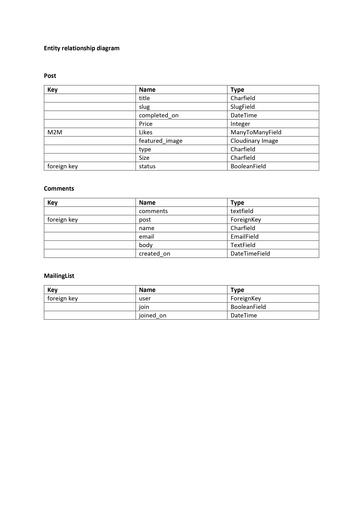

### wireframes

Home view wireframe
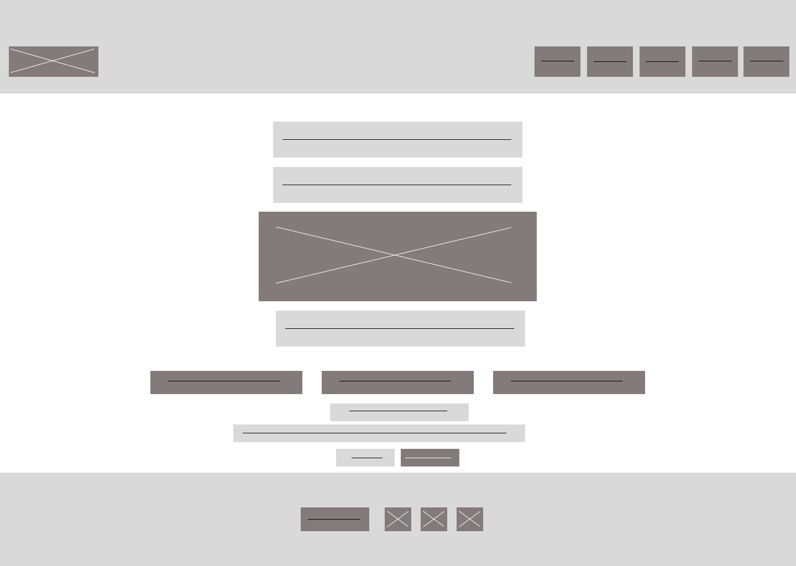

Art view wireframe
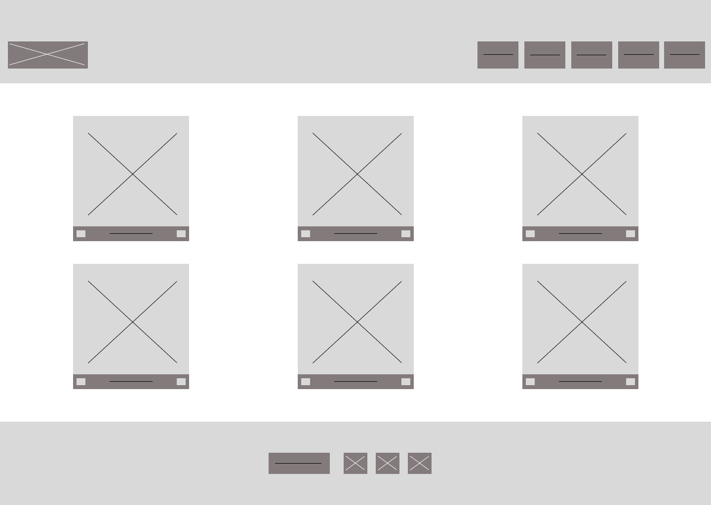

Details view wireframe
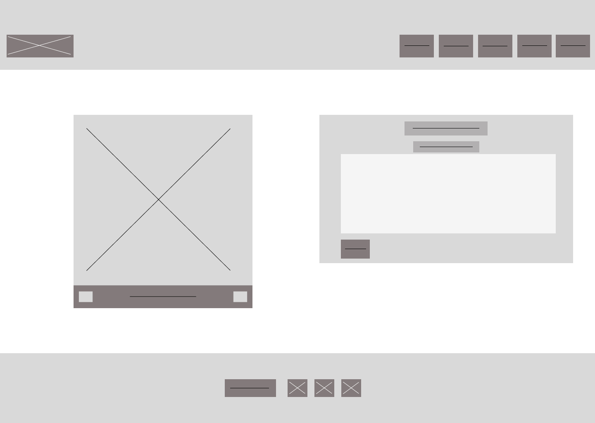

Signin view wireframe
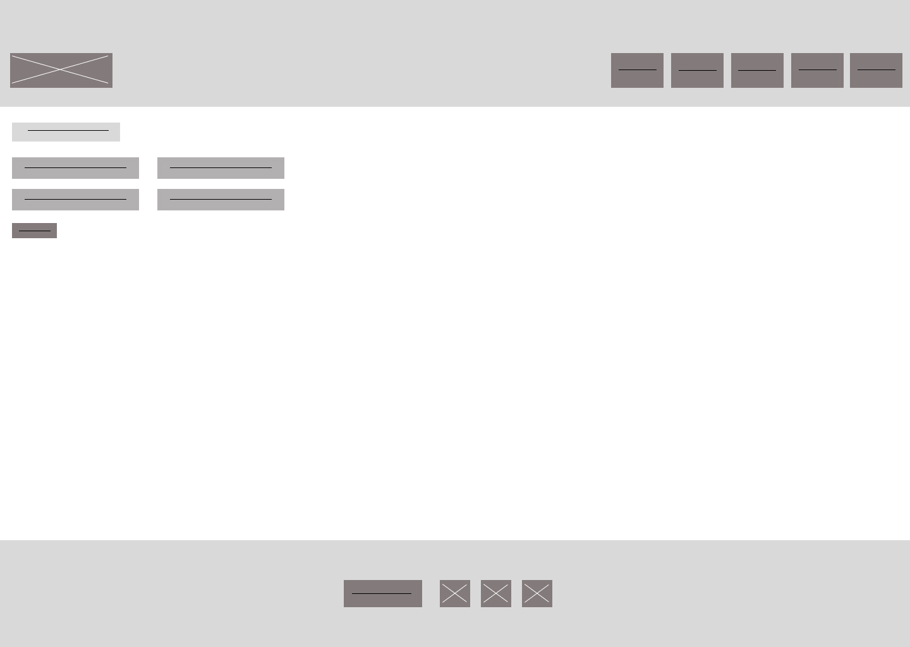

Signup view wireframe
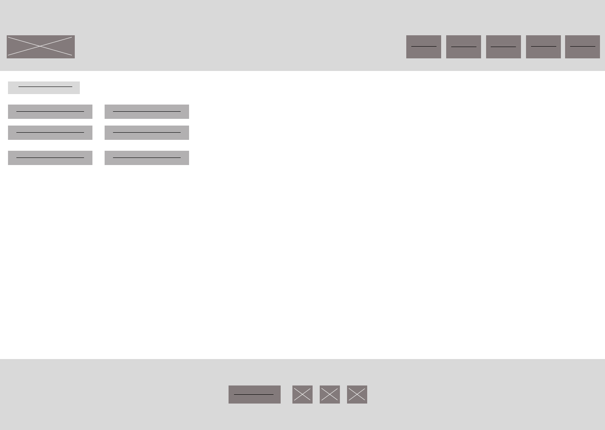

Signout view wireframe
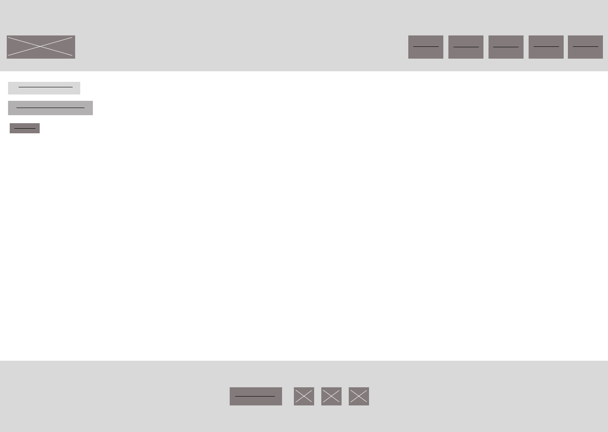

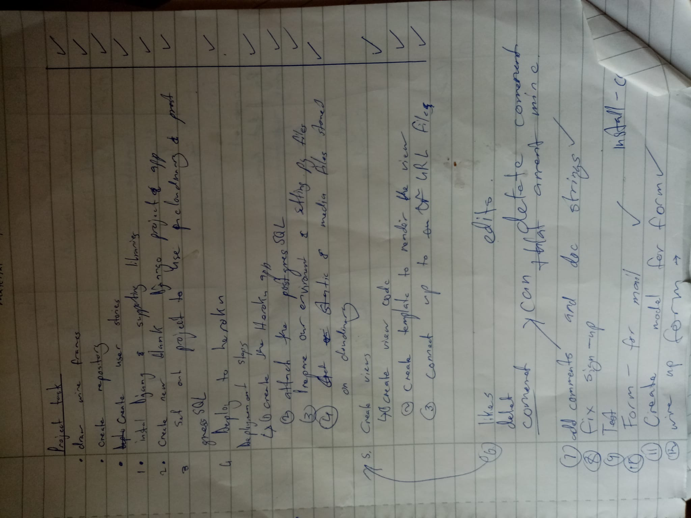

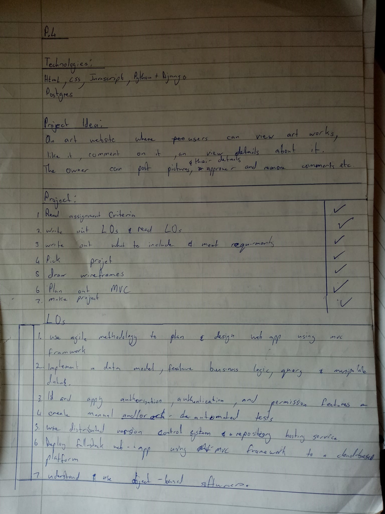

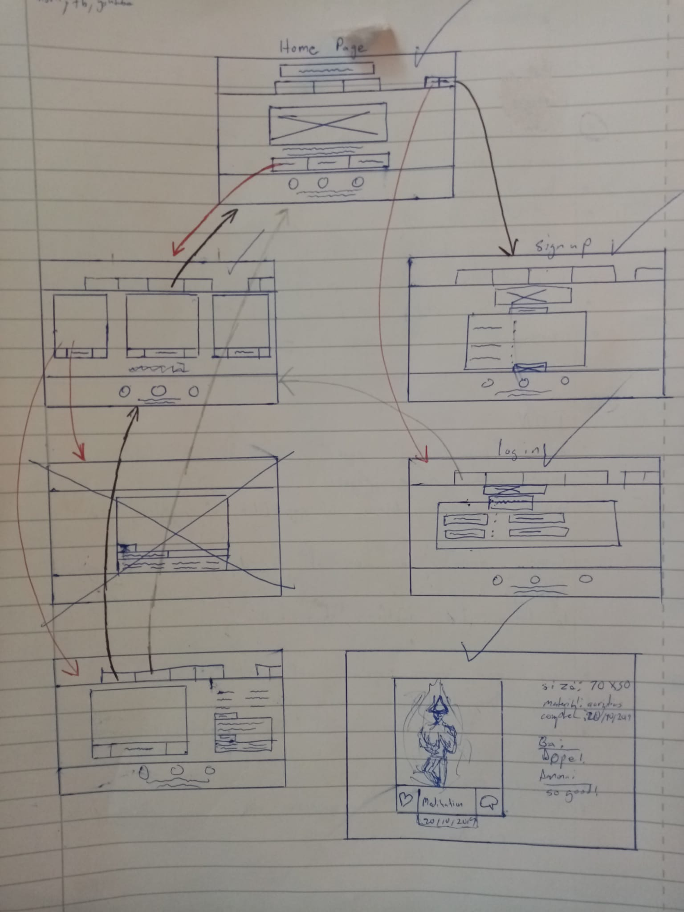

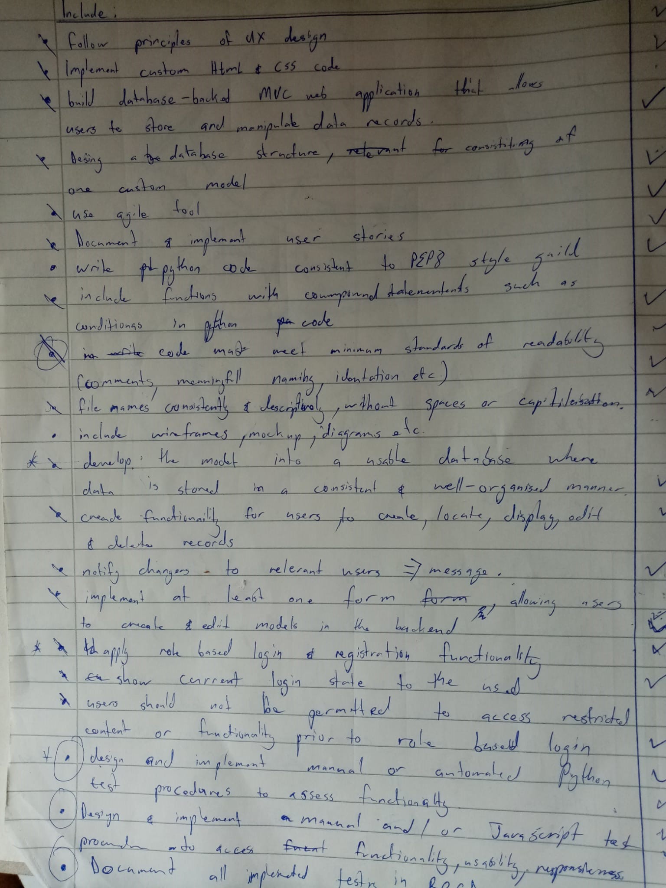

## Bugs and fixes

### bug 1-sign up
The sign up page would not load after a user filled in all the details. Pressing submit would cause an error because allauth was trying to send an email to the email that the user would fill in.

### Solved bugs
To fix this error i added " EMAIL_BACKEND = 'django.core.mail.backends.console.EmailBackend' " to the back end.

## Unfixed bugs

None

## Validator testing

Html - No errors returned from the official w3c validator

CSS - No errors returned from the official (jigsaw) validator

Javascript - No errors returned from the jshint validator

Python - The only errors i have are for the line being too long, i opted not to put them on the next line because they were causeing my app to fail. I also got an E701 error because i revered the oder od date by adding a " - " to my completed_on variable.

This app also  meets the accessibilty requirements of lighthouse in devtools

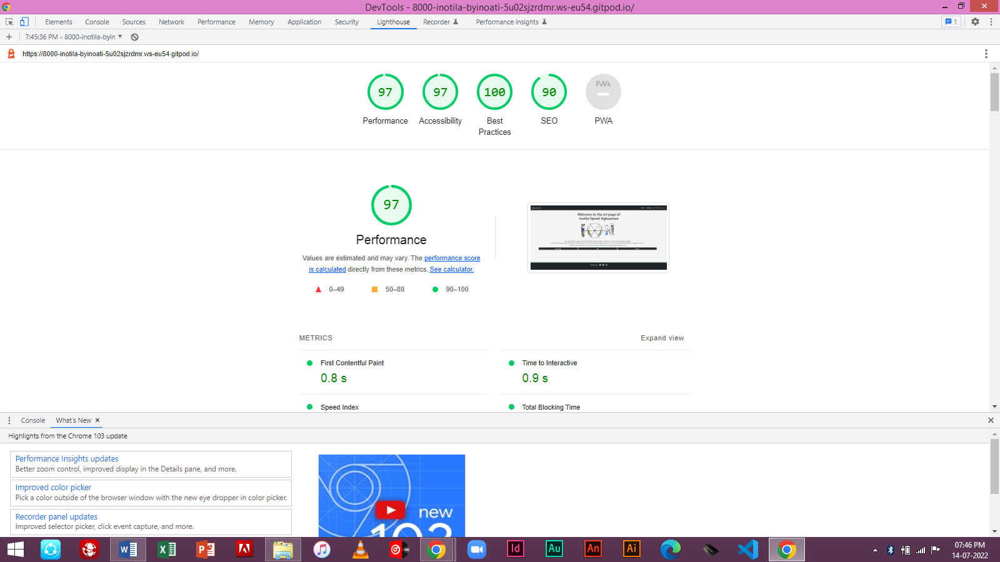

## Deployment

The live deployed application can be found at [by-ino-ati](https://by-ino-ati.herokuapp.com/).

### Heroku Deployment

This project uses [Heroku](https://www.heroku.com), a platform as a service (PaaS) that enables developers to build, run, and operate applications entirely in the cloud.

Deployment steps are as follows, after account setup:

- Select *New* in the top-right corner of your Heroku Dashboard, and select *Create new app* from the dropdown menu.
- Your app name must be unique, and then choose a region closest to you (EU or USA), and finally, select *Create App*.
- From the new app *Settings*, click *Reveal Config Vars*, and set the following key/value pairs:
  - `CLOUDINARY_URL` (insert your own Cloudinary API key here)
  - `DATABASE_URL` (this comes from the **Resources** tab, you can get your own Postgres Database using the Free Hobby Tier)
  - `SECRET_KEY` (this can be any random secret key)

Heroku needs two additional files in order to deploy properly.
- requirements.txt
- Procfile

You can install this project's requirements (where applicable) using: `pip3 install -r requirements.txt`. If you have your own packages that have been installed, then the requirements file needs updated using: `pip3 freeze --local > requirements.txt`

The Procfile can be created with the following command: `echo web: gunicorn byinoati.wsgi > Procfile`

For Heroku deployment, follow these steps to connect your GitHub repository to the newly created app:

Either:
- Select "Automatic Deployment" from the Heroku app.

Or:
- In the Terminal/CLI, connect to Heroku using this command: `heroku login -i`
- Set the remote for Heroku: `heroku git:remote -a <app_name>` (replace app_name with your app, without the angle-brackets)
- After performing the standard Git `add`, `commit`, and `push` to GitHub, you can now type: `git push heroku main`

The frontend terminal should now be connected and deployed to Heroku.

### Local Deployment

*Gitpod* IDE was used to write the code for this project.

To make a local copy of this repository, you can clone the project by typing the follow into your IDE terminal:
- `git clone https://github.com/Inotila/by_ino_ati.git`

You can install this project's requirements (where applicable) using: `pip3 install -r requirements.txt`.

Alternatively, if using Gitpod, you can click below to create your own workspace using this repository.

## Credits/Reference 
This work is the original work of Inotila Nghaamwa, however the following resources were used to supplement:

### Code
I used similar coding approaches to that which was used for the i think and therefore I blog. Particularly the Post and comment method. I therefore added my own custom model in MailingList. In addition I used a similar timeout funciton to make the message alert timeout. 

### Media
All images used are the property of Inotila Nghaamwa.

### Credits 

Content -
Text-Written by Inotila Nghaamwa.

Images - All images used are the property of Inotila Nghaamwa.
